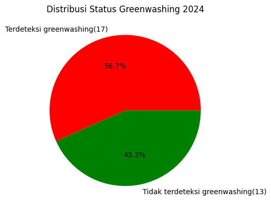

# Analisis Transisi Energi Hijau 2025 di Indonesia
Halo Eco techno leaders!👋<br>
Tahukah kamu bahwa Indonesia punya target <strong>23%</strong> energi terbarukan di <strong>2025</strong> sesuai Peraturan Presiden No. 5 Tahun 2006, namun nyata nya, berdasarkan data Kementerian ESDM, realisasi bauran Energi Baru dan Terbarukan (EBT) di 2023 baru mencapai <strong>12%</strong>, dan hingga akhir 2024 tercapai 14,68%. Dengan kenaikan hanya 2,68% antara tahun 2023 ke 2024, bila berjalan dengan pace yang sama, artinya di akhir 2025 hanya akan tercapai di kisaran 17-18 %.  
Saat ini kita tengah berada pada akhir Q2 2025, tersisa 6 bulan lagi di tahun ini, dengan target yang masih sejauh itu, kita perlu mengusahakan lebih keras agar transisi energi hijau bisa terealisasi sesuai target kita yaitu 23%.  

---
Sebagai langkah awal untuk berkontribusi, kami mencoba untuk menganalisa problem-problem yang ada dalam tiga topik, yaitu :
1. <strong>Kepatuhan regulasi perusahaan mengenai pajak karbon</strong>  
untuk mendorong perusahaan agar dapat mengurangi emisi industri karena tahu ada konsekuensi yang akan diterima jika tidak mengindahkan pengelolaan emisi nya berupa pajak karbon yang akan dibebankan setiap tahun nya.
2. <strong>Deteksi Greenwashing melalui data emisi dan klaim hijau</strong>  
dalam penerapannya, banyak perusahaan melakukan greenwashing, mereka mengklaim ramah lingkungan kepada publik padahal nyata nya emisi yang mereka hasilkan tinggi, hanya karena ingin mencari nama baik ke investor dan publik.
3. <strong>Analisis risiko lahan untuk mengurangi konflik sosial</strong>  
proyek PLTS yang semestinya dapat memberikan kontribusi pada realisasi EBT, dalam penerapannya sering memicu konflik lahan dengan petani dan masyarakat adat yang bisa disebabkan karena kurang nya sosialisasi atau komunikasi yang tidak terjalin dengan baik.

Kami menggunakan sample 30 data sebagai landasan analisis, dengan harapan saat ada sample data lain maka dapat dilakukan hal serupa dari apa yang kami telah buat.

## Topik 1. Kepatuhan Perusahaan terhadap Pajak Karbon
<li> <strong>Tujuan</strong></li>
Melakukan pengecekan apakah emisi perusahaan dari sample data melebihi batas pajak karbon (50 ton CO2)
<li> <strong>Konsep</strong></li>
if-else, dictionary, library pandas untuk membaca data csv, library matplotlib untuk visualisasi ke dalam chart
<li> <strong>Output</strong></li>
Status pajak karbon dan distribusi emisi untuk setiap perusahaan
<li> <strong>Code</strong></li>

```
# import Library yang diperlukan
import pandas as pd
import matplotlib.pyplot as plt

# mendefinisikan fungsi kepatuhan pajak untuk menghitung besar pajak dan status nya
def kepatuhan_pajak(perusahaan, emisi, batas, tarif):
    if emisi > batas:
        pajak = (emisi - batas) * tarif
        status = 'kena pajak karbon'
        print(f"{perusahaan} {status} Rp. {pajak:,}")
    else:
        pajak = 0
        status = 'bebas pajak karbon'
        print(f"{perusahaan} {status}")
    return status,pajak

# mendefinisikan fungsi untuk membuat pie chart
def pie_plot_emisi(dict):
    kena_pajak = sum(1 for data in dict.values() if data['status'] =='kena pajak karbon')
    tidak_kena_pajak = len(dict) - kena_pajak

    labels = [f"kena pajak karbon({kena_pajak})", f"bebas pajak karbon({tidak_kena_pajak})"]
    sizes = [kena_pajak, tidak_kena_pajak]
    colors = ['red', 'green']

    plt.figure()
    plt.pie(sizes, labels = labels, colors = colors, autopct='%1.1f%%')
    plt.title('Distribusi Kepatuhan Pajak Karbon 2024')
    plt.show

# mendefinisikan fungsi untu membuat bar chart
def bar_plot_emisi(dict):
    perusahaan = list(dict.keys())
    emisi = [data['emisi'] for data in dict.values()]

    plt.figure(figsize=(12,6))
    plt.bar(perusahaan,emisi,color='green')
    plt.xlabel('Perusahaan')
    plt.ylabel('Emisi (Ton CO2)')
    plt.title('Emisi Karbon Perusahaan 2024')
    plt.axhline(y=50, color='red', linestyle='--', label='Batas Pajak (50 Ton)')
    plt.legend()
    plt.xticks(rotation=90)
    plt.show()

# membaca file emisi_perusahaan.csv
df = pd.read_csv("assets/emisi_perusahaan.csv")

# menginisiasi variabel yang diperlukan yaitu batas pajak karbon 50 ton, tarif Rp 20000 per ton, dan dictionary kosong
batas = 50
tarif = 20000
pajak_dict = {}

# melakukan iterasi untuk setiap barus di dataframe, kemudian menyimpan ke dictionary
for index, row in df.iterrows():
    perusahaan = row['Nama_Perusahaan']
    emisi = row['Emisi_2024']
    status,pajak = kepatuhan_pajak(perusahaan, emisi, batas, tarif)
    pajak_dict[perusahaan] = {
        'emisi' : emisi,
        'pajak' : pajak,
        'status' : status
    }

# memanggil fungsi untuk membuat chart
pie_plot_emisi(pajak_dict)
bar_plot_emisi(pajak_dict)

```
<li><strong>Output Program</strong></li>

```
PT_Textilindo kena pajak karbon Rp. 250,000.0
PT_Semindo bebas pajak karbon
PT_EnergiJaya kena pajak karbon Rp. 564,000.0
PT_Pulpindo kena pajak karbon Rp. 100,000.0
PT_AgroMakmur bebas pajak karbon
PT_BajaSentosa kena pajak karbon Rp. 374,000.00000000006
PT_KimiaFarindo bebas pajak karbon
PT_MiningCo kena pajak karbon Rp. 648,000.0000000001
PT_PetroJaya kena pajak karbon Rp. 217,999.99999999997
PT_SinarLogam kena pajak karbon Rp. 72,000.00000000003
PT_IndoPlastik bebas pajak karbon
PT_BumiEnergi kena pajak karbon Rp. 505,999.99999999994
PT_TextilMakmur kena pajak karbon Rp. 295,999.99999999994
PT_SemenBerkah bebas pajak karbon
PT_KertasJaya kena pajak karbon Rp. 177,999.99999999997
PT_AgroSentosa bebas pajak karbon
PT_BajaIndo kena pajak karbon Rp. 404,000.00000000006
PT_KimiaJaya bebas pajak karbon
PT_TambangMakmur kena pajak karbon Rp. 611,999.9999999999
PT_PetroMakmur kena pajak karbon Rp. 262,000.00000000003
PT_LogamBerkah kena pajak karbon Rp. 85,999.99999999994
PT_PlastikJaya bebas pajak karbon
PT_EnergiMakmur kena pajak karbon Rp. 556,000.0
PT_TextilBerkah kena pajak karbon Rp. 328,000.0000000001
PT_SemenJaya bebas pajak karbon
...
PT_AgroBerkah bebas pajak karbon
PT_BajaMakmur kena pajak karbon Rp. 441,999.9999999999
PT_KimiaMakmur kena pajak karbon Rp. 5,999.999999999944
PT_TambangJaya kena pajak karbon Rp. 714,000.0
```


<li> <strong>Insight</strong></li>
Dari data dan chart tersebut, dapat kita lihat bahwa ada cukup banyak perusahaan yang menghasilkan emisi diatas batas, yaitu 1/3 dari total 30 perusahaan, yang berarti masih cukup banyak perusahaan yang butuh perhatian lebih agar bisa mengolah emisi lebih efektif sehingga mereka pun tidak perlu mengeluarkan biaya tambahan berupa pajak karbon.

## Topik 2. Deteksi Greenwashing Berdasarkan Data Emisi dan Klaim Hijau
<li> <strong>Tujuan</strong> </li>
Melakukan validasi apakah perusahaan melakukan greenwashing dari klaim hijau dan emisi yang diciptakan perusahaan tersebut
<li> <strong>Konsep</strong></li>
if-else, dictionary, library pandas untuk membaca data csv, library matplotlib untuk visualisasi ke dalam chart 
<li> <strong>Output</strong></li>
Status greenwashing untuk setiap perusahaan 
<li> <strong>Code</strong></li>

```
# import Library yang diperlukan
import pandas as pd
import matplotlib.pyplot as plt

# mendefinisikan fungsi cek greenwashing untuk memverifikasi klaim hijau dengan emisi yang dihasilkan
def cek_greenwashing(perusahaan, emisi, klaim, batas):
    if klaim.lower() == 'ya' and emisi > batas:
        status = 'terdeteksi greenwashing'
        print(f"{perusahaan} {status} dengan emisi: {emisi} ton, klaim hijau: {klaim}.")
    else:
        status = 'tidak terdeteksi greenwashing'
        print(f"{perusahaan} {status}.")
    return status

# mendefinisikan fungsi untuk membuat pie chart
def pie_plot_greenwash(dict):
    greenwashing = sum(1 for data in dict.values() if data['status'] =='terdeteksi greenwashing')
    tidak_greenwashing = len(dict) - greenwashing

    labels = [f"Terdeteksi greenwashing({greenwashing})", f"Tidak terdeteksi greenwashing({tidak_greenwashing})"]
    sizes = [greenwashing, tidak_greenwashing]
    colors = ['red', 'green']

    plt.figure()
    plt.pie(sizes, labels = labels, colors = colors, autopct='%1.1f%%')
    plt.title('Distribusi Status Greenwashing 2024')
    plt.show

# membaca file emisi_perusahaan.csv
df = pd.read_csv("assets/emisi_perusahaan.csv")

# menginisiasi variabel yang diperlukan yaitu batas pajak karbon 50 ton dan dictionary kosong
batas = 50
status_dict = {}

# melakukan iterasi untuk setiap barus di dataframe, kemudian menyimpan ke dictionary
for index, row in df.iterrows():
    perusahaan = row['Nama_Perusahaan']
    emisi = row['Emisi_2024']
    klaim = row['Klaim_Hijau']
    status = cek_greenwashing(perusahaan,emisi,klaim,batas)
    status_dict[perusahaan] = {
        'emisi' : emisi,
        'klaim' : klaim,
        'status' : status
    }

# memanggil fungsi untuk membuat chart
pie_plot_greenwash(status_dict)
```

<li> <strong>Output Program </strong> </li>

```
PT_Textilindo terdeteksi greenwashing dengan emisi: 62.5 ton, klaim hijau: ya.
PT_Semindo tidak terdeteksi greenwashing.
PT_EnergiJaya terdeteksi greenwashing dengan emisi: 78.2 ton, klaim hijau: ya.
PT_Pulpindo terdeteksi greenwashing dengan emisi: 55.0 ton, klaim hijau: ya.
PT_AgroMakmur tidak terdeteksi greenwashing.
PT_BajaSentosa terdeteksi greenwashing dengan emisi: 68.7 ton, klaim hijau: ya.
PT_KimiaFarindo tidak terdeteksi greenwashing.
PT_MiningCo terdeteksi greenwashing dengan emisi: 82.4 ton, klaim hijau: ya.
PT_PetroJaya tidak terdeteksi greenwashing.
PT_SinarLogam terdeteksi greenwashing dengan emisi: 53.6 ton, klaim hijau: ya.
PT_IndoPlastik tidak terdeteksi greenwashing.
PT_BumiEnergi terdeteksi greenwashing dengan emisi: 75.3 ton, klaim hijau: ya.
PT_TextilMakmur terdeteksi greenwashing dengan emisi: 64.8 ton, klaim hijau: ya.
PT_SemenBerkah tidak terdeteksi greenwashing.
PT_KertasJaya terdeteksi greenwashing dengan emisi: 58.9 ton, klaim hijau: ya.
PT_AgroSentosa tidak terdeteksi greenwashing.
PT_BajaIndo terdeteksi greenwashing dengan emisi: 70.2 ton, klaim hijau: ya.
PT_KimiaJaya tidak terdeteksi greenwashing.
PT_TambangMakmur terdeteksi greenwashing dengan emisi: 80.6 ton, klaim hijau: ya.
PT_PetroMakmur tidak terdeteksi greenwashing.
PT_LogamBerkah terdeteksi greenwashing dengan emisi: 54.3 ton, klaim hijau: ya.
PT_PlastikJaya tidak terdeteksi greenwashing.
PT_EnergiMakmur terdeteksi greenwashing dengan emisi: 77.8 ton, klaim hijau: ya.
PT_TextilBerkah terdeteksi greenwashing dengan emisi: 66.4 ton, klaim hijau: ya.
PT_SemenJaya tidak terdeteksi greenwashing.
...
PT_AgroBerkah tidak terdeteksi greenwashing.
PT_BajaMakmur terdeteksi greenwashing dengan emisi: 72.1 ton, klaim hijau: ya.
PT_KimiaMakmur tidak terdeteksi greenwashing.
PT_TambangJaya terdeteksi greenwashing dengan emisi: 85.7 ton, klaim hijau: ya.
```



<li> <strong> Insight </strong></li>
Cukup banyak perusahaan yang melakukan praktik greenwashing, 56% atau 17 dari 30 perusahaan, ini menandakan bahwa dibutuhkan pengawasan atau standar yang lebih ketat terhadap klaim hijau yang diterbitkan, agar kepercayaan konsumen tetap terjaga dan kebijakan-kebijakan terkait EBT yang sudah dan akan diterapkan dapat tepat sasaran dan bisa dievaluasi dengan baik.


## Topik 3. Analisis risiko lahan untuk mengurangi konflik sosial
<li> <strong> Tujuan </strong></li>
Melakukan analisa proyek PLTS mana saja yang memiliki risiko terjadi konflik lahan
<li> <strong> Konsep </strong></li>
if-else, dictionary, library pandas untuk membaca data csv, library matplotlib untuk visualisasi ke dalam chart
<li> <strong> Output </strong></li>
Status risiko konflik lahan untuk setiap proyek PLTS
<li> <strong>Code</strong></li>

```
# import Library yang diperlukan
import pandas as pd
import matplotlib.pyplot as plt

# mendefinisikan fungsi analisa risiko untuk mencari tahu proyek PLTS mana saja yang berisiko terjadi konflik lahan
def analisa_risiko(proyek, luas, konflik, standar):
    if luas > standar or konflik == 'ya':
        status = 'berisiko konflik lahan'
        print(f"Proyek {proyek} {status}")
    else:
        status = 'aman dari konflik lahan'
        print(f"Proyek {proyek} {status}")
    return status

# mendefinisikan fungsi untuk membuat pie chart
def pie_plot_konflik(dict):
    berisiko = sum(1 for data in dict.values() if data['status'] =='berisiko konflik lahan')
    tidak_berisiko = len(dict) - berisiko

    labels = [f"Berisiko Konflik Lahan({berisiko})", f"Aman dari Konflik Lahan({tidak_berisiko})"]
    sizes = [berisiko, tidak_berisiko]
    colors = ['red', 'green']

    plt.figure()
    plt.pie(sizes, labels = labels, colors = colors, autopct='%1.1f%%')
    plt.title('Distribusi Risiko Konflik Lahan Proyek PLTS')
    plt.show

# membaca file konflik_lahan.csv
df = pd.read_csv("assets/konflik_lahan.csv")

# menginisiasi variabel yang diperlukan yaitu standar luas 500 ha dan dictionary kosong
standar_luas = 500
risiko_dict = {}

# melakukan iterasi untuk setiap barus di dataframe, kemudian menyimpan ke dictionary
for index, row in df.iterrows():
    proyek = row['Nama_Proyek']
    luas = row['Luas_Lahan']
    konflik = row['Status_Konflik']
    status = analisa_risiko(proyek, luas, konflik, standar_luas)
    risiko_dict[proyek] = {
        'luas' : luas,
        'konflik' : konflik,
        'status' : status
    }

# memanggil fungsi untuk membuat chart
pie_plot_konflik(risiko_dict)
```

<li><strong>Output Program</strong></li>

```
Proyek PLTS_Jawa1 berisiko konflik lahan
Proyek PLTS_Sulawesi1 berisiko konflik lahan
Proyek PLTS_Jawa2 aman dari konflik lahan
Proyek PLTS_Bali1 berisiko konflik lahan
Proyek PLTS_Sumatera1 aman dari konflik lahan
Proyek PLTS_Kalimantan1 berisiko konflik lahan
Proyek PLTS_Jawa3 aman dari konflik lahan
Proyek PLTS_Sulawesi2 berisiko konflik lahan
Proyek PLTS_Banten1 berisiko konflik lahan
Proyek PLTS_Sumatera2 berisiko konflik lahan
Proyek PLTS_Jawa4 aman dari konflik lahan
Proyek PLTS_Bali2 berisiko konflik lahan
Proyek PLTS_Kalimantan2 aman dari konflik lahan
Proyek PLTS_Sulawesi3 berisiko konflik lahan
Proyek PLTS_Jawa5 aman dari konflik lahan
Proyek PLTS_Sumatera3 berisiko konflik lahan
Proyek PLTS_Banten2 aman dari konflik lahan
Proyek PLTS_Jawa6 berisiko konflik lahan
Proyek PLTS_Sulawesi4 aman dari konflik lahan
Proyek PLTS_Bali3 berisiko konflik lahan
Proyek PLTS_Kalimantan3 aman dari konflik lahan
Proyek PLTS_Jawa7 berisiko konflik lahan
Proyek PLTS_Sumatera4 berisiko konflik lahan
Proyek PLTS_Banten3 berisiko konflik lahan
Proyek PLTS_Sulawesi5 berisiko konflik lahan
...
Proyek PLTS_Kalimantan4 berisiko konflik lahan
Proyek PLTS_Bali4 berisiko konflik lahan
Proyek PLTS_Sumatera5 berisiko konflik lahan
Proyek PLTS_Jawa9 berisiko konflik lahan
```


<li> <strong>Insight</strong></li>
Mayoritas dari proyek PLTS yang ada dalam sample data berisiko terjadi konflik lahan, ada sebanyak 21 (70%) dari total 30 proyek PLTS, melalui data ini, pemerintah dapat memfokuskan untuk mengerjakan proyek PLTS yang aman dari konflik agar dapat tercapai lebih banyak persentase EBT Indonesia, serta untuk proyek yang berisiko terjadi konflik lahan, pemerintah dapat fokus untuk membantu mediasi dan mencari solusi yang baik bagi pemerintah dan pemilik lahan demi tercipta nya keadilan tanpa penindasan.